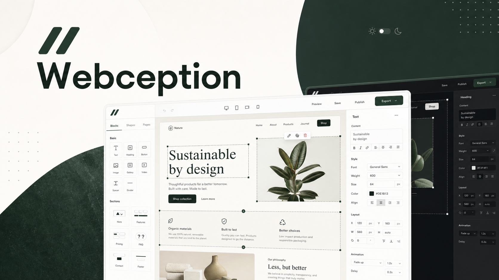

<p align="center">
  
</p>

<h1 align="center">Webception</h1>

<p align="center">
  A freeform website builder for sketching, styling, animating, and exporting polished static pages.
</p>

<p align="center">
  
</p>

## What It Does

Webception is a local-first website studio built with React and Vite. It gives you a Wix-like canvas where you can place blocks freely, tune styles, preview responsive layouts, and export a ready-to-host ZIP.

## Features

- Freeform drag-and-resize canvas
- Desktop, tablet, and mobile frame modes
- System, light, and dark editor themes
- Font picker with Satoshi, General Sans, Hind, and Nunito
- Blocks for navbars, heroes, text, buttons, images, cards, pricing, FAQ, contact forms, stats, video placeholders, and footers
- Shapes including rectangles, circles, lines, pills, blobs, badges, and icon marks
- Animation controls for fade, rise, slide, scale, blur, duration, delay, easing, and looping
- Starter, portfolio, and event templates
- Undo, redo, duplicate, delete, layer controls, clear all, and reset starter
- ZIP export containing `index.html`, `styles.css`, and `script.js`

## Tech Stack

- React
- TypeScript
- Vite
- JSZip
- Playwright

## Run Locally

```bash
npm install
npm run dev
```

## Checks

```bash
npm run build
npm run lint
npm run test:e2e
```

## Export Flow

Use the editor, press **Download**, and Webception creates a static site ZIP. The exported site includes layout styles, responsive overrides, Fontshare font links, and CSS animation keyframes.

## Project Status

Webception is a working local-first builder prototype. It is designed for quick Hack Club-style demos, project pages, portfolios, event pages, and landing-page experiments.
